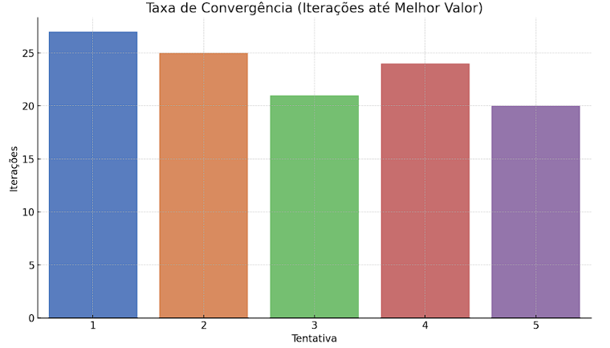
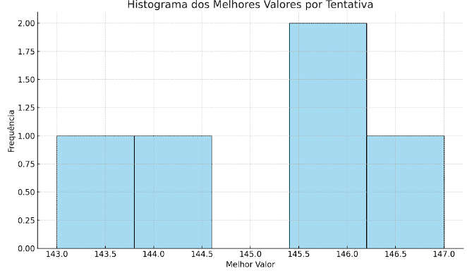
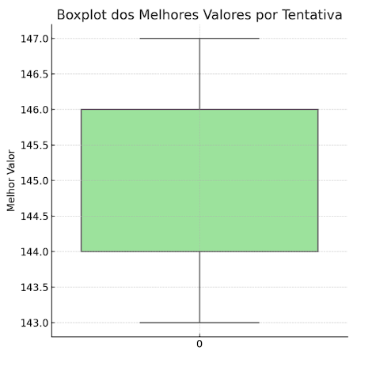

# Otimização do Problema da Mochila com PSO Binário

## Integrantes da Equipe

* Larissa Hoffmann
* Lukas Thiago
* Mateus Akira
* Matheus Gabriel

## 1. Objetivo

Implementar e testar o algoritmo bio-inspirado PSO Binário (Particle Swarm Optimization) para resolver o Problema da Mochila 0/1, considerando diferentes tamanhos de instâncias, e realizar uma avaliação do desempenho.

## 2. Algoritmo Utilizado: PSO Binário

O PSO tradicional opera em espaços contínuos, mas o **PSO Binário** adapta a lógica para lidar com variáveis discretas (0 ou 1). Cada partícula representa uma possível solução (seleção de itens) codificada como um vetor binário. A movimentação das partículas ocorre em um espaço contínuo de velocidades, que são posteriormente transformadas em decisões binárias via função sigmoide.

## 3. Modelagem do Problema

### 3.1 Lista de Pesos e Valores

* Cada item possui um peso (inteiro aleatório entre 1 e 50).
```
 pesos = [random.randint(1, 50) for _ in range(n_itens)]
```
* E um valor (entre 10 e 100)
```
valores = [random.randint(10, 100) for _ in range(n_itens)]
```

### 3.2 Capacidade da Mochila

* É definido como 40% da soma total dos pesos.
```
 capacidade = int(sum(pesos) * capacidade_percentual)
```

### 3.3 Representação das Soluções

* Vetor binário: cada posição indica se o item correspondente foi incluído (1) ou não (0).  
`Mochila (itens levados): [1, 0, 1, 0, 0, 0, 1, 1, 0, 0, 0, 1, 0, 1, 1, 1, 0, 0, 0, 0, 0, 1, 0, 1...]`
---

## 4. Implementação do Algoritmo

### 4.1 Funções Utilizadas

* `avaliar`: Responsável por calcular o valor total dos itens selecionados e verificar se a solução respeita a restrição de capacidade da mochila. Caso o peso exceda, a solução é penalizada com valor 0.
```
def avaliar(solucao, valores, pesos, capacidade):
    peso_total = sum(pesos[i] for i in range(len(solucao)) if solucao[i] == 1)
    valor_total = sum(valores[i] for i in range(len(solucao)) if solucao[i] == 1)
    if peso_total > capacidade:
        return 0 
    return valor_total
```

* `sigmoid`: Função de ativação que transforma a velocidade (valor contínuo) em uma probabilidade de que a posição da partícula seja 1. 
```
def sigmoid(x):
    return 1 / (1 + math.exp(-x))
```
* `pso_mochila`: Executa o algoritmo PSO Binário, com atualização de velocidade e posições conforme as equações do PSO tradicional.
     
> Inicialização
```
def pso_mochila(valores, pesos, capacidade, n_particulas=30, n_iteracoes=50, c1=1.5, c2=1.5, w=0.8):
    if len(valores) != len(pesos):
        raise ValueError("Listas de valores e pesos devem ter o mesmo tamanho.")

    n = len(valores)
    particulas = [[random.randint(0, 1) for _ in range(n)] for _ in range(n_particulas)]
    velocidades = [[random.uniform(-1, 1) for _ in range(n)] for _ in range(n_particulas)]
```
* `particulas`: representa o enxame, onde cada partícula é uma solução binária (0 ou 1 para cada item).
* `velocidades`: vetor contínuo associado a cada partícula e item, usado para calcular a probabilidade de mudança de estado.

> Melhores locais e global
```
 p_best = particulas[:]
    p_best_valores = [avaliar(p, valores, pesos, capacidade) for p in particulas]

    g_best = max(p_best, key=lambda x: avaliar(x, valores, pesos, capacidade))
    g_best_valor = avaliar(g_best, valores, pesos, capacidade)
```
* `p_best`: melhor solução já encontrada por cada partícula.
* `g_best`: melhor solução encontrada por todo o enxame até o momento.

> Loop de iterações
```
 for iteracao in range(n_iteracoes):
        for i in range(n_particulas):
            for j in range(n):
                r1 = random.random()
                r2 = random.random()
```
* Gera dois números aleatórios r1 e r2, usados para ponderar a influência da melhor posição individual (cognitiva) e global (social).

> Atualização de velocidade e posição (núcleo do PSO)
```
velocidades[i][j] = (
                    w * velocidades[i][j] +
                    c1 * r1 * (p_best[i][j] - particulas[i][j]) +
                    c2 * r2 * (g_best[j] - particulas[i][j])
                )

                prob = sigmoid(velocidades[i][j])
                particulas[i][j] = 1 if random.random() < prob else 0
```
* A nova velocidade depende da inércia `(w)`, do comportamento pessoal `(c1 * r1 * )` e da influência do grupo `(c2 * r2 *)`.
* A velocidade é passada pela função sigmoide para gerar uma probabilidade de ativação.
* A posição binária é então atualizada com base nessa probabilidade.

> Avaliação e atualização dos melhores
```
  valor_atual = avaliar(particulas[i], valores, pesos, capacidade)
            if valor_atual > p_best_valores[i]:
                p_best[i] = particulas[i][:]
                p_best_valores[i] = valor_atual
```

> Avaliação global
```
melhor_index = p_best_valores.index(max(p_best_valores))
        if p_best_valores[melhor_index] > g_best_valor:
            g_best = p_best[melhor_index][:]
            g_best_valor = p_best_valores[melhor_index]
```  

> Histórico e Retorno
```
 historico.append(g_best_valor)
        print(f"Iteração {iteracao+1} | Melhor valor: {g_best_valor}")

    return g_best, g_best_valor, historico
```  

### 4.2 Operadores PSO
O algoritmo PSO simula o comportamento coletivo de partículas em busca de uma solução ótima. O movimento das partículas é guiado por três componentes:

* Inércia (w): Mantém o movimento anterior.
```
 w * velocidades[i][j]
``` 
* Atração cognitiva (c1): Atrai a partícula para sua melhor solução.
```
c1 * r1 * (p_best[i][j] - particulas[i][j])
``` 
* Atração social (c2): Atrai a partícula para a melhor solução global.
```
c2 * r2 * (g_best[j] - particulas[i][j])
``` 
### 4.3 Binarização com probabilidade gerada pela função sigmoide. 

Converte a velocidade em probabilidade e define se o bit será 1 ou 0
```
prob = sigmoid(velocidades[i][j])
                particulas[i][j] = 1 if random.random() < prob else 0
``` 

---

## 5. Avaliação das Soluções

### 5.1 Penalização

* Soluções com peso total acima da capacidade recebem valor 0.
```
 if peso_total > capacidade:
        return 0 
``` 

### 5.2 Função de Aptidão

* Soma total dos valores dos itens selecionados (se válida).

### 5.3 Métricas Comparadas

Durante as execuções, são coletadas as seguintes métricas:

* Valor total da mochila (fitness);

* Peso total da solução;

* Histórico da melhor solução global a cada iteração;

* Tempo de execução;

Além disso, ao final das execuções, são exibidas estatísticas globais:
```
  print("\nEstatísticas após múltiplas execuções:")
    print(f"Média dos melhores valores: {sum(resultados)/len(resultados):.2f}")
    print(f"Melhor valor obtido: {max(resultados)}")
    print(f"Pior valor obtido: {min(resultados)}")

    peso_final = calcular_peso(melhor_solucao_global, pesos)
    print(f"\nMelhor solução global:")
    print(f"Valor: {melhor_valor_global} | Peso: {peso_final}")
    print(f"Mochila (itens levados): {melhor_solucao_global}") 
``` 

### 5.4 Complexidade

* Tempo de execução por iteração: O(n \* p), onde:

  * *n*: quantidade de itens
  * *p*: número de partículas
  * Para *i* iterações: O(n \* p \* i)

---

## 6. Execução e Testes

### 6.1 Parâmetros Utilizados

* 100 itens (aleatórios), 5 execuções, 50 iterações, 30 partículas.

### 6.2 Exemplos de Entrada/Saída

* **Entrada:**

  * Lista de pesos: `[10, 22, 17, 9, 33, 2, ...]`
  * Lista de valores: `[50, 80, 45, 60, 90, 55, ...]`
  * Capacidade: `842`
    
* **Saída:**
  * Valor total obtido: `1378`
  * Peso da mochila: `827`
  * Solução binária: `[1, 0, 1, 1, 0, ...]`

### 6.3 Resultados

* Melhor valor global: `1410`
* Pior valor obtido: `1284`
* Média das execuções: `1345.6`

### 6.4. Resultados Agregados

| Execução | Valor Total | Peso Total | Iteração do Melhor Valor | 
|----------|--------------|------------|---------------------------|
| 1        | 1378         | 827        | 42                        | 
| 2        | 1284         | 798        | 48                        | 
| 3        | 1410         | 840        | 39                        | 
| 4        | 1345         | 815        | 46                        | 
| 5        | 1312         | 801        | 43                        | 


### 7. Gráficos

* 
* 
* 
* 
---

## 8. Dificuldades e Aprendizados

### 8.1 Dificuldades

* Binarização eficiente da velocidade;
* Ajuste dos hiperparâmetros `(w, c1, c2)`;
* Controle da aleatoriedade para reprodutibilidade;
* Ajustar penalidades sem eliminar boas soluções por pouco excesso de peso.

### 8.2 Aprendizados

* PSO é eficaz mesmo com busca estocástica;
* Importância da função de aptidão e dos parâmetros;
* Visualização e histórico ajudam a entender o comportamento do algoritmo;
* Modularização do código facilita testes e manutenção.

---

## 9. Sugestões para Testes Futuros

* Testar com 1000 e 10.000 itens.
* Implementar outras abordagens bio-inspiradas (GA, ABC, ACO).
* Usar análise estatística para consolidar os resultados.
* Automatizar a coleta de métricas e geração de relatórios
* Explorar variantes multiobjetivo (valor x peso)


---

## 10. Execução

```bash
python pso_mochila.py
```

Certifique-se de ter o pacote `matplotlib` instalado:

```bash
pip install matplotlib
```
